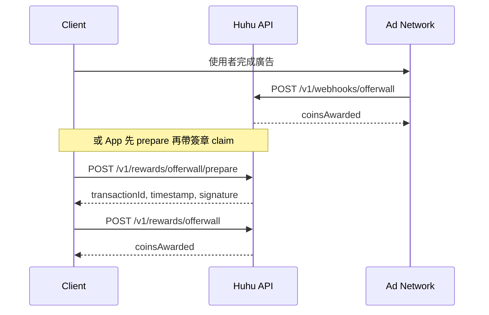

# Offerwall 整合

呼呼 Huhu 的觀看廣告獎勵採 **HMAC 簽章 + 一次性 transactionId**，避免客戶端偽造領幣。

## 環境變數

| 變數 | 說明 |
|------|------|
| `OFFERWALL_SECRET` | 與廣告聯播網／後端共用的密鑰（≥32 字元隨機字串建議） |
| `OFFERWALL_ALLOWED_IPS` | 可選，逗號分隔；設定後 `/v1/webhooks/offerwall` 僅接受列出的來源 IP |

未設定時：開發環境可直接 `POST /v1/rewards/offerwall`（無簽章），僅受每日上限限制。

## 客戶端設定（Meta）

`GET /v1/meta/offerwall`（無需登入）回傳整合模式與端點：

| 欄位 | 說明 |
|------|------|
| `mode` | `dev_direct`（無密鑰）或 `verified`（需 HMAC） |
| `verificationRequired` | 是否必須 prepare + 簽章 claim |
| `webhookIpRestricted` | 是否已設定 `OFFERWALL_ALLOWED_IPS` |
| `dailyCap` / `coinsPerReward` | 與 `@huhu/shared` 常數一致 |
| `sdkIntegration` | 固定 `hmac_only`（未內建第三方 SDK） |

App / Web 應依 `mode` 決定走 prepare+claim 或直接 claim（僅開發）。

## 流程（生產）



### 1. 伺服器回調（建議）

廣告完成後，聯播網伺服器呼叫：

`POST /v1/webhooks/offerwall`

```json
{
  "userId": "<huhu_user_id>",
  "transactionId": "partner_unique_id",
  "timestamp": "2026-06-04T12:00:00.000Z",
  "signature": "<hex_hmac_sha256>"
}
```

簽章計算（與 API 一致）：

```
base = userId + "|" + transactionId + "|" + timestamp
signature = HMAC_SHA256(OFFERWALL_SECRET, base)  // hex 小寫
```

- `timestamp` 必須為 ISO 8601，與伺服器時鐘誤差 ±5 分鐘內。
- 相同 `transactionId` 重複提交回 **409** `transaction_already_redeemed`。
- 使用者每日上限見 `OFFERWALL_DAILY_CAP`（`@huhu/shared`）。

### 2. 客戶端 prepare + claim

適用於 App 內嵌 WebView / SDK 無法直接打 webhook 的情況：

1. `POST /v1/rewards/offerwall/prepare`（需 Bearer JWT）  
   回傳 `{ verificationRequired: true, transactionId, timestamp, signature }`

2. 廣告完成後 `POST /v1/rewards/offerwall`（同 JWT）  
   Body 帶上 prepare 回傳的三個欄位。

## 錯誤碼

| HTTP | reason | 說明 |
|------|--------|------|
| 401 | `invalid_signature` / `timestamp_expired` | 簽章或時間無效 |
| 409 | `transaction_already_redeemed` | 重複交易 |
| 429 | `offerwall_daily_cap` | 當日次數用盡 |

## 安全建議

- 勿將 `OFFERWALL_SECRET` 編進 App；webhook 僅在伺服器端簽章。
- 正式上線前設定 `OFFERWALL_ALLOWED_IPS` 限制 webhook 來源 IP。
- 避免問卷類高詐欺 Offerwall；僅接影片／CPI 類型。

## 相關程式

- `packages/shared/src/offerwall-meta.ts` — `buildOfferwallClientMeta`
- `GET /v1/meta/offerwall`
- `apps/api/src/services/offerwall-verify.ts`
- `apps/web/app.js`、`apps/mobile/lib/services/huhu_api.dart`（prepare + claim）
